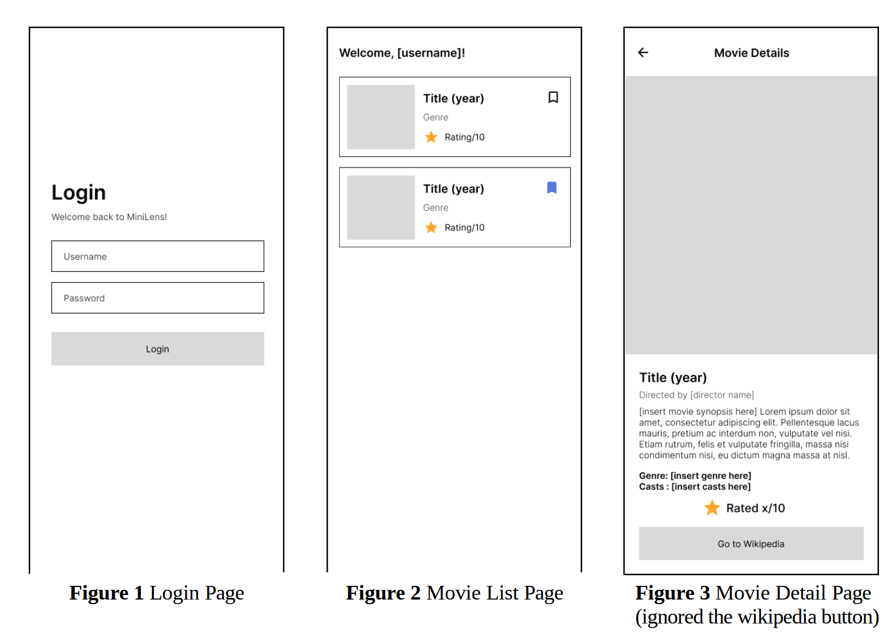

# latihan_kuis_a

Based on https://github.com/lunaisme/latihan_kuis_a#

Quiz Practice
Instruction
1. Read the instructions carefully and do your best
2. Clone this repository: https://github.com/lunaisme/latihan_kuis_a.git
3. Create a new repository on GitHub with name format [Quiz-Student ID].
4. Push your work to the repository and submit the link on SPADA.
5. NOTE: DO NOT ZIP YOUR PROJECT.

 

  
### List of Requirements:
- Login Page (20 pts)
Create a login page consisting of username and password fields. Use the last 3 digits of your
Student ID for the correct entry. Navigate to the movie list page after a successful login.

- Movie List Page (30 pts)
Create a movie list page with ListView. Ensure that the movie’s image, title, year, genre,
and rating are displayed. When a list item is clicked, a page with the movie details will
appear.

- Movie Detail Page (35 pts)
This page should include the movie’s poster, title, release year, genre, director, cast, rating,
and a detailed synopsis. The page provides an engaging layout with clear typography and
structured sections. Users can easily navigate back to the movie list.

- Add To List Button (15 pts)
Each movie in the list should have an 'Add to List' button. By default, the button should have
a white background with a gray or black outline. When clicked, it should change to blue with
a blue outline.

Wireframe Example: 

